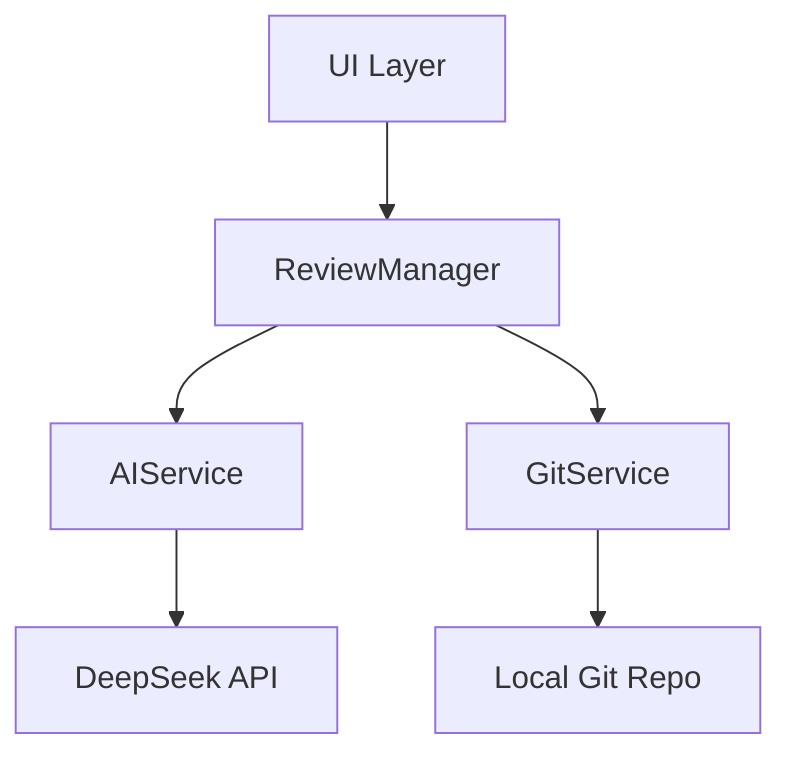
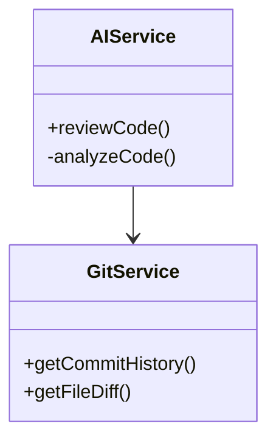

# CodeKarmic Developer Guide

## Architecture



### Core Components



## Tech Stack

- Core Framework: VS Code Extension API
- AI Integration: DeepSeek Chat Completion
- Version Control: simple-git
- Testing Framework: Jest

## Development Setup

```bash
# Install dependencies
npm install

# Enable watch mode
npm run watch
```

## Building and Testing

```bash
# Run unit tests
npm test

# Build extension
npm run build

# Package VSIX
npm run package
```

## Contributing

1. Fork the repository
2. Create a feature branch
3. Make your changes
4. Write/update tests
5. Submit a pull request

## API Configuration

Add your API keys to `.env`:

```env
DEEPSEEK_API_KEY=your_api_key_here
```
