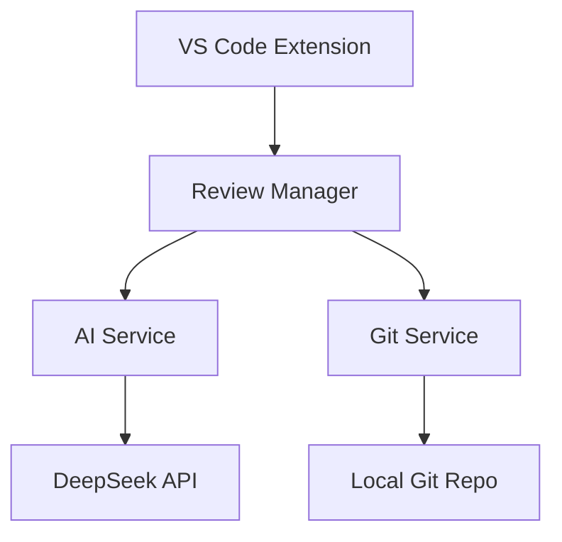

# CodeSage 开发者指南

## 架构设计

### 核心模块

- `src/aiService.ts`: AI 服务集成
- `src/gitService.ts`: Git 操作管理
- `src/reviewManager.ts`: 代码审查逻辑
- `src/notificationManager.ts`: 通知管理

### 技术栈

- VS Code Extension API
- DeepSeek AI
- TypeScript
- simple-git

## 开发环境设置

1. 克隆仓库
```bash
git clone https://github.com/nesnilnehc/CodeSage.git
cd CodeSage
```

2. 安装依赖
```bash
npm install
```

3. 在 VS Code 中打开
```bash
code .
```

4. 按 F5 开始调试

## 构建和测试

```bash
# 运行测试
npm test

# 构建扩展
npm run build

# 打包 VSIX
npm run package
```

## 发布流程

1. 更新版本号
2. 更新更新日志
3. 提交代码
4. 创建标签
5. 发布到 VS Code Marketplace

## API 密钥配置

在 `.env` 文件中配置：
```env
DEEPSEEK_API_KEY=your_api_key_here
```

## 架构图



## 代码风格

- 使用 TypeScript 严格模式
- 遵循 VS Code 扩展开发最佳实践
- 使用 ESLint 进行代码检查
- 保持代码简洁和模块化

## 测试指南

- 单元测试：使用 Jest
- 集成测试：使用 VS Code 测试框架
- 手动测试：关注核心功能和边缘情况

## 调试技巧

1. 使用 VS Code 调试器
2. 检查输出面板中的日志
3. 使用断点进行调试
4. 测试不同的 Git 仓库场景

## 性能优化

- 异步处理大型仓库
- 缓存常用数据
- 优化 AI 请求频率
- 减少不必要的文件读写
